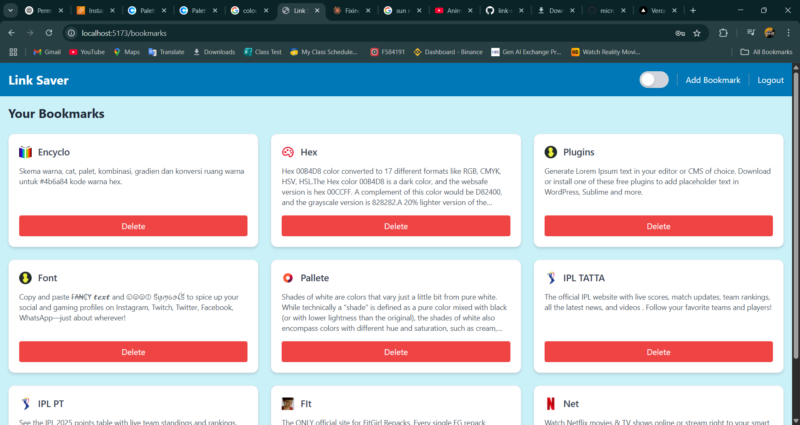

# 🔖 Link Saver + Auto-Summary App

A full-stack web application to save, organize, and summarize web links using AI. Built with **React**, **Tailwind CSS**, **Node.js**, **Express**, and **MongoDB**.

---

## 🌟 Features

- 🔐 JWT-based authentication (Register / Login)
- 🌙 Light/Dark theme toggle
- ➕ Add and save bookmarks
- 📚 View all saved bookmarks
- 🤖 Summarize URLs using Jina AI API
- ⚙️ Responsive UI with modern design

---

## 🛠️ Tech Stack

**Frontend:**
- React + Vite
- Tailwind CSS
- React Router

**Backend:**
- Node.js + Express
- MongoDB + Mongoose
- bcrypt, JWT
- express-session, connect-mongo

---

## 🚀 Setup Instructions

### 1. Clone the repository

git clone https://github.com/your-username/link-saver-app.git
cd link-saver-app

makefile
Copy
Edit

### 2. Install dependencies

**Backend:**

cd server
npm install

makefile
Copy
Edit

**Frontend:**

cd ../client
npm install

bash
Copy
Edit

### 3. Environment Variables

Create the following `.env` files:

**📁 /server/.env**

MONGO_URI=your_mongodb_connection_string
JWT_SECRET=your_jwt_secret
SESSION_SECRET=your_session_secret

bash
Copy
Edit

**📁 /client/.env**

VITE_API_BASE=http://your-server-ip-or-domain:5000

markdown
Copy
Edit

### 4. Run the Application

**Start Backend:**

cd server
npm start

java
Copy
Edit

**Start Frontend (Dev):**

cd ../client
npm run dev

shell
Copy
Edit

### 5. Build & Deploy Frontend

To build the frontend for production:

cd client
npm run build

yaml
Copy
Edit

This creates a production-ready `dist/` folder. You can use NGINX or any static file server to host it.

---

## 📸 Screenshots

---

## 🧠 AI Integration

This app uses the Jina AI Summarization API to automatically generate summaries from bookmarked URLs.

---

## 🔐 Auth Flow

JWT tokens are stored in localStorage after login.

Sessions are managed securely via `express-session` and `connect-mongo` on the backend.

---

## 👨‍💻 Author

Made with ❤️ by Ashish Singh